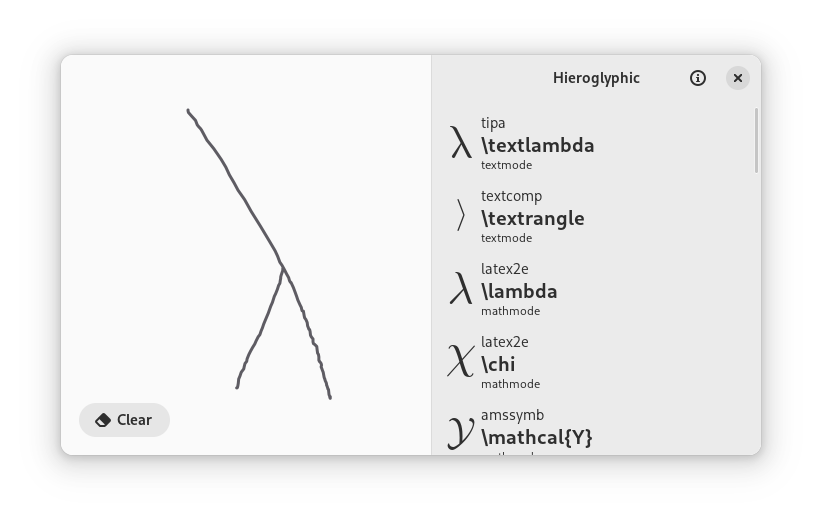
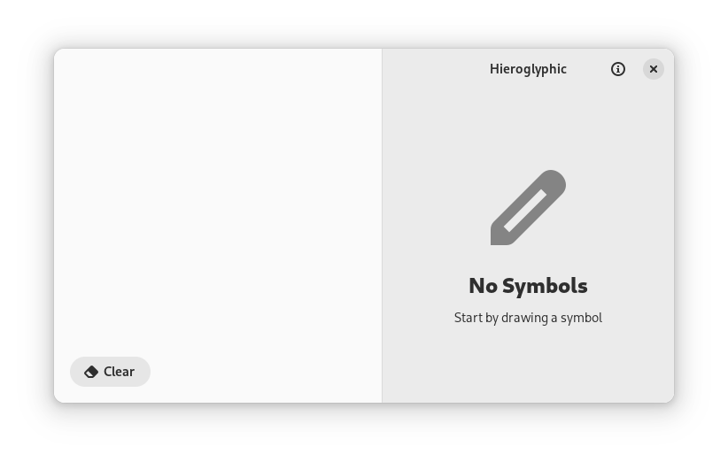

# Hieroglyphic

If you work with LaTeX, you know it's difficult to memorize the names of all the symbols. Hieroglyphic allows you to search through over 1000 different LaTeX symbols by sketching. Once you found the desired symbol you can copy it to the clipboard by clicking on the entry. Hieroglyphic is based of [detexify](https://detexify.kirelabs.org/classify.html) and is powered by a port of the [detexify classifier](https://github.com/zoeyfyi/detexify-rust).

  
More screenshots

# Features

- Over 1000 LaTeX symbols across multiple packages (same set as detexify) 
- Completely offline

## Installation

### Flatpak

## Contributing

Contributors are expected to follow the [GNOME Code of Conduct](https://conduct.gnome.org/).

Any contributions you make are greatly appreciated. For major changes, please open an issue first to discuss what you would like to change.

To contribute:

1. [Fork the Project](https://github.com/FineFindus/Hieroglyphic/fork)
2. Create your Feature Branch (`git checkout -b feature/AmazingFeature`)
3. Commit your Changes (`git commit -m 'feat: add some AmazingFeature'`)
4. Push to the Branch (`git push origin feat/AmazingFeature`)
5. Open a Pull Request

This project uses [conventional commits](https://www.conventionalcommits.org/)

### Translation

Translations are a great way to contribute. This project uses the [GNU gettext](https://www.gnu.org/software/gettext/manual/html_node/index.html#SEC_Contents) for translations. If you want to learn more, visit the [translator section](https://www.gnu.org/software/gettext/manual/html_node/Translators.html#Translators).

After finishing the translations, add the translated language code into the [LINGUAS](po/LINGUAS) file. Then follow the above steps to create a pull request.

## Building

See this [general guide](https://wiki.gnome.org/Newcomers/BuildProject) for building the project using GNOME Builder.

## Credits

A huge thanks to all the libraries used and all the FOSS apps for inspiration. Special thanks to

- [TeX Match](https://github.com/zoeyfyi/TeX-Match) from which this was forked
